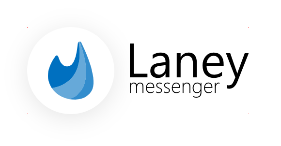
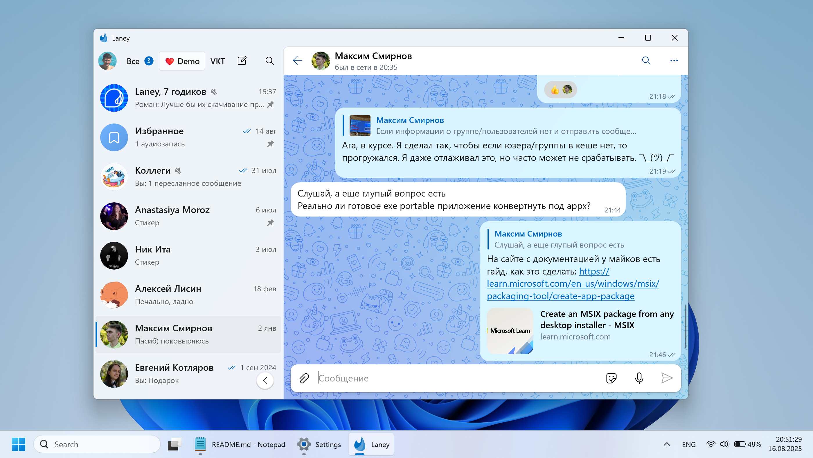

<picture>
  <source media="(prefers-color-scheme: dark)" width="480px" srcset="Screenshots/logo_dark.png">
  <source media="(prefers-color-scheme: light)" width="480px" srcset="Screenshots/logo_light.png">
  
</picture>

Это репозиторий первой, оригинальной версии Laney — мессенджера ВКонтакте для Windows 10/11 UWP. Если вы ищете _новую кросс-платформенную_ версию, вам [сюда](https://github.com/Elorucov/Laney-Avalonia). 

<picture align="center">
  <source media="(prefers-color-scheme: dark)" srcset="Screenshots/Screenshot_dark.webp">
  <source media="(prefers-color-scheme: light)" srcset="Screenshots/Screenshot_light.webp">
  
</picture>

> [!WARNING]
> __Обновлено в декабре 2025-го__: отныне приложение использует только APP ID официальных клиентов, в данном случае это APP ID десктопной версии VK Мессенджера. С мая 2026-го все старые Standalone-приложения, возможно, перестанут работать из-за отключении со стороны ВК старого способа авторизации (OAuth). Несмотря на это, рекомендуется авторизоваться с помощью QR-кода, либо включить 2FA с помощью приложения-генератора кодов.

__Пожалуйста, прочтите этот README. Он содержит ответы на вопросы, которые у вас могут возникнуть при изучении репозитория и при попытке запуска и использовании приложения.__

## История разработки и слова автора
Проект был создан 24 июня 2018-го года. За два года до этого, сразу после выхода Win 10 и платформы UWP, я начал разрабатывать приложения для неё. В основном это был аудиопроигрыватели и всякие мелкие тулзы для себя. Тут важно отметить, что я тогда пользовался смартфоном на Windows 10 Mobile (помните Nokia Lumia?), и для меня было круто создавать приложения, которые работают одинаково и на компе, и на телефоне.

Прошло два года, и после некоторых событий (не спрашивайте каких), а также из-за желания разрабатывать приложение другого типа и опубликовать его, я принял решение написать клиент для ВК. Ага, полноценный клиент, но из-за моего недостаточного опыта я решил начать с мессенджера. В то время я был немного знаком с VK API, но с разделом сообщений я никогда до этого не был знаком. Да и в целом я понятия не имел, как устроен мессенджер ВК.

Добравшись до публичного релиза бета-версии в октябре 2019-го, я понял, что надо бы отрефакторить весь проект, т. к. за это время некоторые важные места в коде были переписаны два, а может быть и 3 раза (внешний вид сообщений и его рендеринг, например). Первоначально даже хотел не релизнуть её, а переписать заново уже с нормальной архитектурой благодаря знаниям, которые я получил во время разработки. Но потом принял решение всё-таки релизить именно как бету, ибо почти многое из запланированных фич было уже готово. Параллельно я создал ещё один проект для рефакторинга, и он должен был бы в будущем стать Laney 2.0. Далее 2.0 буду называть как __L2__, а текущую версию как __L1__. Исходный код L2 находится в ветке [`l2`](https://github.com/Elorucov/Laney-Legacy/tree/l2)

Весь 2020 и половину 2021-го я дорабатывал L1 и параллельно разрабатывал L2. Всё это время я сталкивался с проблемами со стороны UWP, особенно при разработке L2, ибо для него планировал такие фичи, которые нельзя было просто так портировать на L1 из-за архитектурных различий (мультиаккаунт и сообщения сообщества, которые работали параллельно в разных окнах, например). Летом и осенью 2021-го я сделал перерыв в разработке L2 и сосредоточился над L1. К тому моменту я уже реализовал почти всё запланированные для него фичи, и благодаря выходу Windows 11 начал делать редизайн. Тем более во многих местах приложения использовались нестандартные (т. е. не соответствующий гайдлайнам) цвета и пр. метрики UI. Я понял, что до L1 не может так долго оставаться в бете и он [вышел](https://vk.com/wall-171015120_166) из него в 2021-м.

А тем временем, многие из моих знакомых и пользователи L1 желали, чтобы я создал Laney и для macOS. И даже для мобильных ОС, хотя я против этого. К тому моменту и у меня возникло желание создать кросс-платформенную десктопную версию, т. к. я замечал, что UWP перестал развиваться. Однако в 2021-м году Microsoft выпустили [Windows App SDK](https://aka.ms/winappsdk) (говоря простыми языками — духовный наследник платформы UWP, приложения, написанные с использованием этого SDK, по факту являлись Win32-программой, а в качестве UI используется почти та же технология, что и в UWP). Осенью решил потыкать этот SDK и портировать в него L2 — это могло бы дать такие фичи, как полноценная работа в фоне (и _сворачивание в трей!_) и, как я надеялся, нормальная работа с несколькими окнами (ибо в UWP это работало через задницу). Какого же было моё удивление, когда в релизной версии не было возможности создавать более одного окна! В общем, забросил я это дело и... начал разработку Laney с использованием кросс-платформенного графического фреймворка Avalonia. Но это уже другая история.

В общем, на тот момент публично был доступен только L1, с архитектурными изъянами, из-за которого со временем стало всё сложнее и сложнее поддерживать его. С 2022-го в ВК стали появляться фичи, которые не были доступны сторонним приложениям (они и раньше-то были, просто их стало больше), и которые желали пользователи. Принял решение использовать обходные пути для реализации подобных фич, что усложнило и без того сложную архитектуру приложения. А в 2023-м ВК сменили страницу авторизации со старого _OAuth_, которая могла работать без JS, на _VK ID_, написанный полностью на React, и по этой причине отвалилась авторизация. Пришлось реализовать обходные пути, и это ещё сильнее повлиял на надёжность и стабильность приложения. И много чего ещё (редизайн настроек и связанный с этим костыли с навигацией, лента...)

Ну а последними гвоздями в крышку гроба стали:
* то, что ВК вставляет палки в колёса (например, обновленная капча (a. k. a. _no robot captcha_), теперь надо открывать страницу в WebView, и она не работает на старом движке Edge, используемый в UWP-приложениях)
* очевидная (на мой взгляд) стагнация развития мессенджера самим ВК (из-за рекламирующегося сами знаете чего)
* прекращение развития UWP со стороны MS.

В общем, пользователям и разрабам на UWP (а особенно поддерживающие Windows 10 Mobile) желаю удачи.

## Важно, для тех, кто хочет поддержать дальнейшее развитие данной версии
* Сделайте форк проекта и разрабатывайте его под другим именем и лого, чтобы не было путаницы. Укажите в самом приложении (в About) и в репозитории инфу о том, что оно основано на UWP-версии Laney.
* Оставьте номер мажорной версии "1". Меняйте минорную версию только если обновление значительное.
* __Push-уведомления не будут работать__, т. к. они привязаны на `APP ID` в ВК и на продукт в MS Store. Т. е., чтобы их завести, вам надо будет создать продукт в MS Store, создать Standalone-приложение в ВК с правами доступа к сообщениям (что невозможно с 2024-го года, однако если оно у вас был создан ранее, то вам повезло), указать в настройках приложения параметры уведомления из настройки продукта из MS Store и прописать ProductId продукта в файл package.appxmanifest в проекте.
* Если испытываете проблему со входом (из-за того самого no robot captcha, например), то __нажмите 5 раз на логотип Laney (на круг с лого)__. У вас появится возможность зайти по `access_token`-у.

## Начало работы
* Установите __Visual Studio 2022__. При выборе компонентов в разделе __WinUI application development__ отметьте __Universal Windows Platform tools__, __Windows 11 SDK (10.0.26100.4188)__ и __Windows 11 SDK (10.0.22621.0)__.
* Установите __Git__, если не установлено.
* Клонируйте репозиторий: `git clone --recurse-submodules https://github.com/Elorucov/Laney-Legacy.git`
* В папке `Laney-Legacy` запустите проект `Elorucov.Laney.sln`

## Q&A
_(будет дополняться)_
#### Чем отличаются проекты _Elorucov.Laney_ и _Elorucov.Laney.MPP_?
В __MPP__ используется новый метод упаковки приложения (обратите внимание на проект `ModernPackagingProject`). Создан был для проверки внедрения и запуска обычных exe-приложений в десктопе. Для примера сделал провайдер виджетов, который отображал кастомный виджет с друзьями онлайн в панели виджетов в Windows 11. Но я засомневался в том, что в MS пропустит такое в магазин. Однако вы можете с помощью него добавить, например, отдельную фоновую программу, которая отображает уведомления и значок в трее (подобное сделано в Unigram-е, кстати).

## Отличия от последней версии (1.30.200) из Microsoft Store
* Удалена отправка крашрепортов.
* По умолчанию присутствует пункт "Debug" в меню.
* Отключена проверка наличия новой версии прилодения: закомменчен код для проверки обновлений из MS Store.
* Название приложения в меню изменён на "Laney (legacy)". Поверх логотипа внутри приложения (страница входа, about) отображается блок с надписью "Legacy".
* На странице «О приложении» появилась ссылка на репозиторий и убраны ненужные ссылки; поменялась надпись об авторе.
